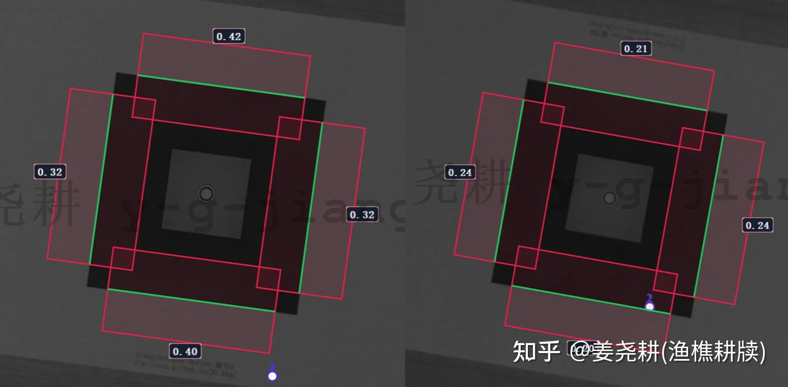
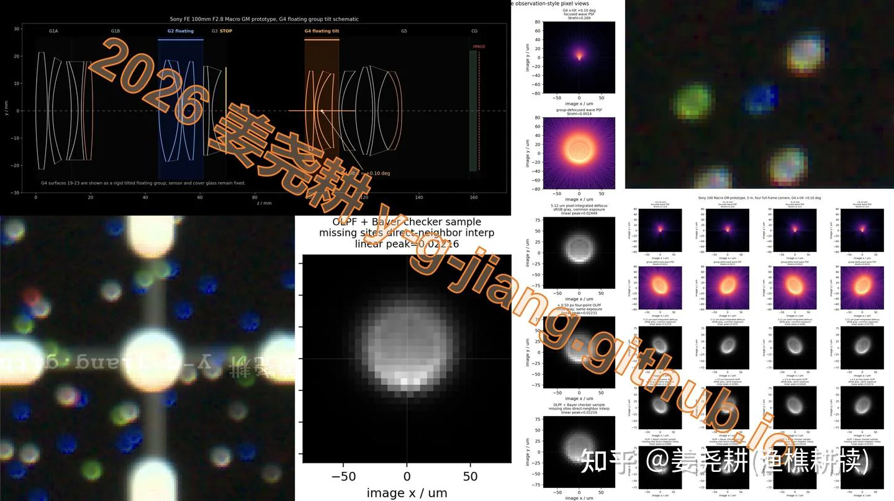
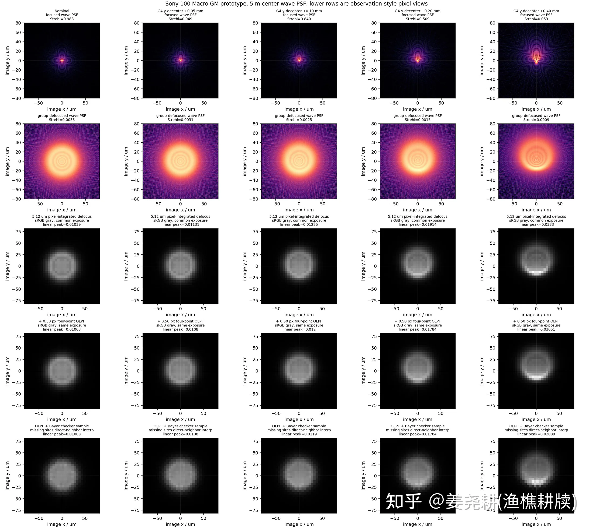
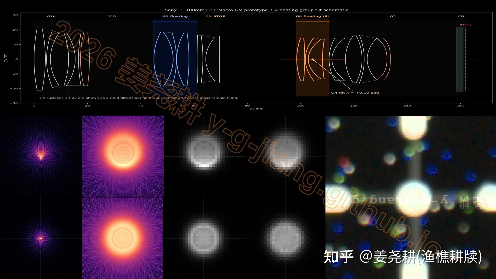
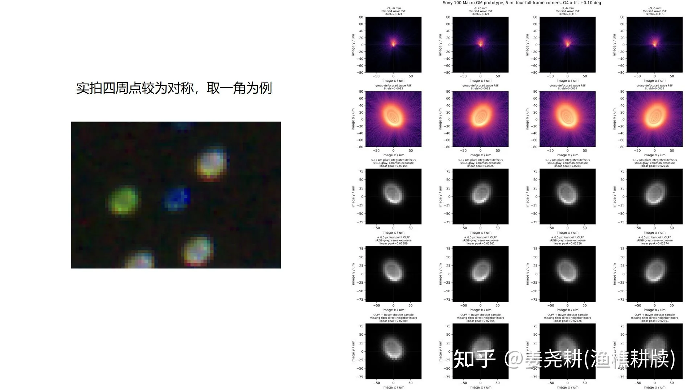
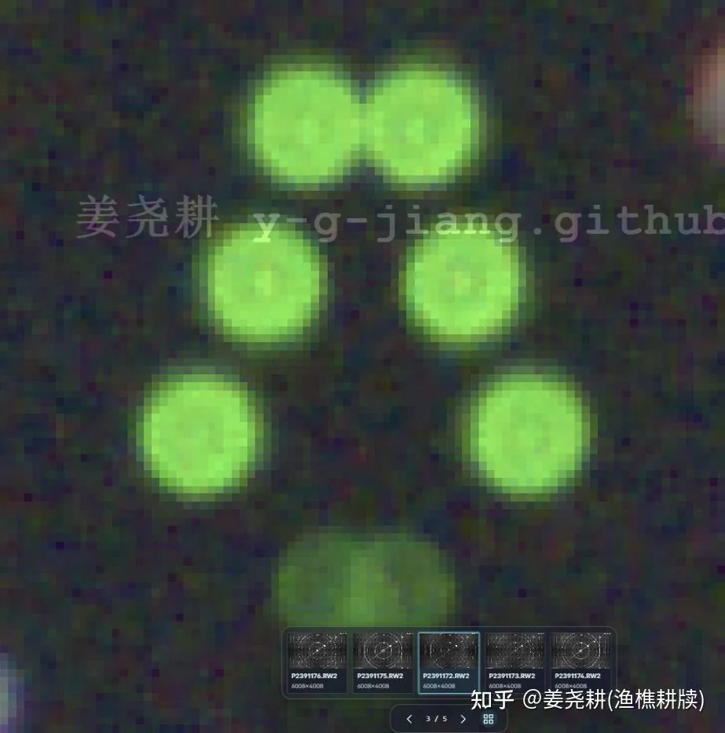

我会从两方面展开。1，关于索尼100GM新微距，起码是一个大批次的竖拍歪轴问题的实拍以及仿真还原并评论重力歪轴这个现象；2，如何快速测量你的镜头是否歪轴。

首先关于100GM歪轴的问题，我是从一个朋友的手中镜头实拍中第一次发现的，且在门店的100GM展镜中已经复现，这两支100GM在竖拍和倒拍的场景下表现非常灾难。在我把这个问题发在其他平台上后，短时间内也有大量反馈指向这个镜头竖拍有问题。但另一个新买的100GM表现很好，anvcor首发的那支100GM虽然能看出有一点歪，但也还说得过去。

先说线下的展镜和这个朋友的镜头吧。这两支100GM+a7m5在竖拍工况下表现非常灾难，体现为竖拍明显模糊，倒拍上下边MTF50减半。注意a7m5就能明显看出了。于是我让他拍摄了本视频后面我会提到的靶子，以及我上个视频中提到的这个分辨率靶子，得到了很多数据。

竖拍时，他中心的弥散圆能量严重不均。那么我们来尝试分析一下到底是哪片镜组歪轴导致的。使用他拍摄得到的中间的弥散圆和四周的弥散圆，我对100GM的所有镜组分别模拟，并把问题精确定位到了一个后对焦浮动组G4的倾斜，角度是0.1度。

模拟很好验证了猜测。我也确定了这不是防抖组的问题，也大概不是其他镜组的问题，不是其他形式的歪轴。例子中，靠前的镜组歪轴会让中心表现一定的情况下，对称的边上视场的入射结果差异巨大，而实拍中四周弥散圆是非常对称的。

下面我们说如何来评价你的镜头有没有歪轴。

拍

[evaPSF](https://github.com/y-g-jiang/y-g-jiang.github.io/blob/main/evapsf.png)

这个靶子。

把白框完全填满画面，虚焦到中间上面两个粘在一起：

分别横拍、竖拍，看中间的光斑、四周的视场是否对称。如果四周的弥散圆对称，中心也正圆，那么你的镜头就可以认为是不歪轴的了。如果不确定的话，欢迎加群1025168246，咱们可以在群里讨论。
