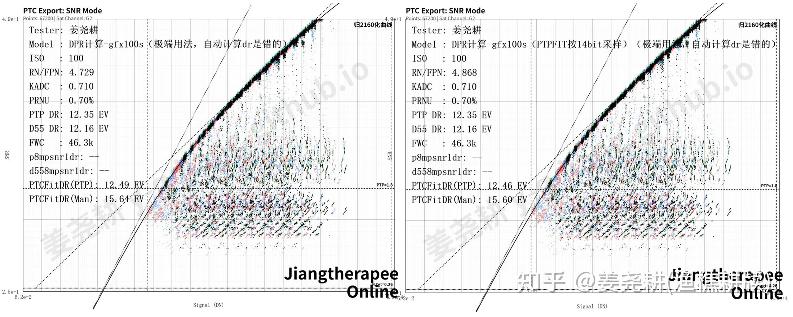
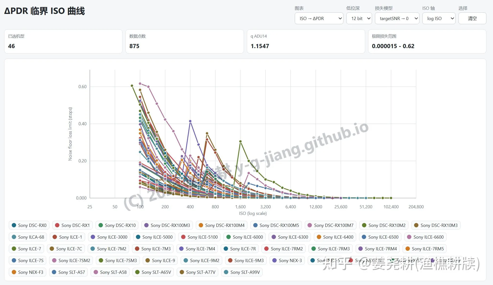
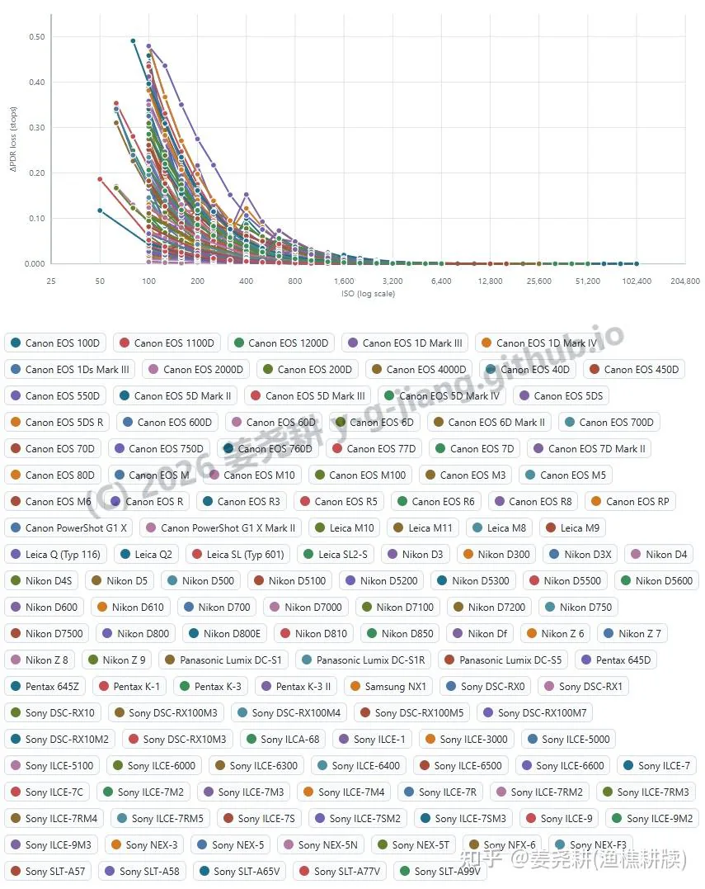
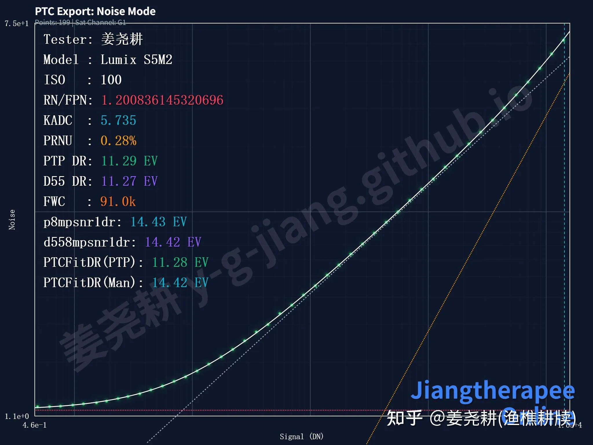
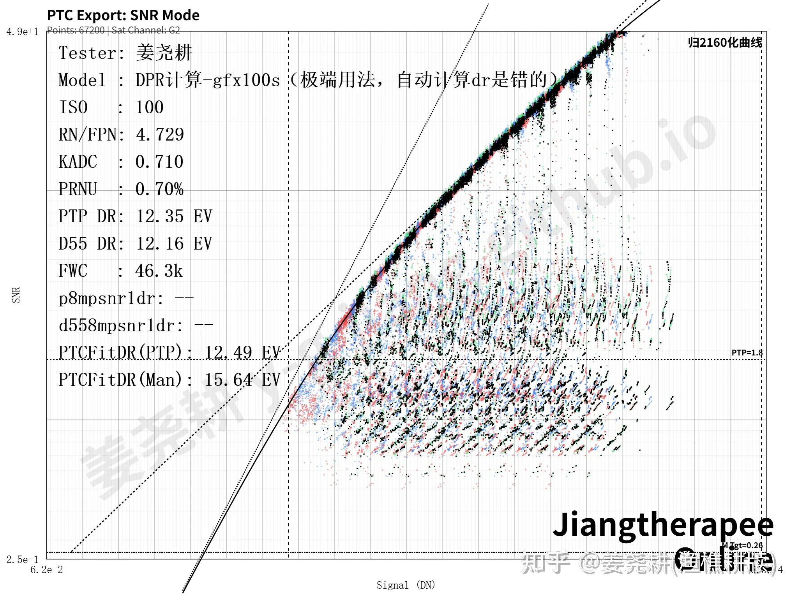
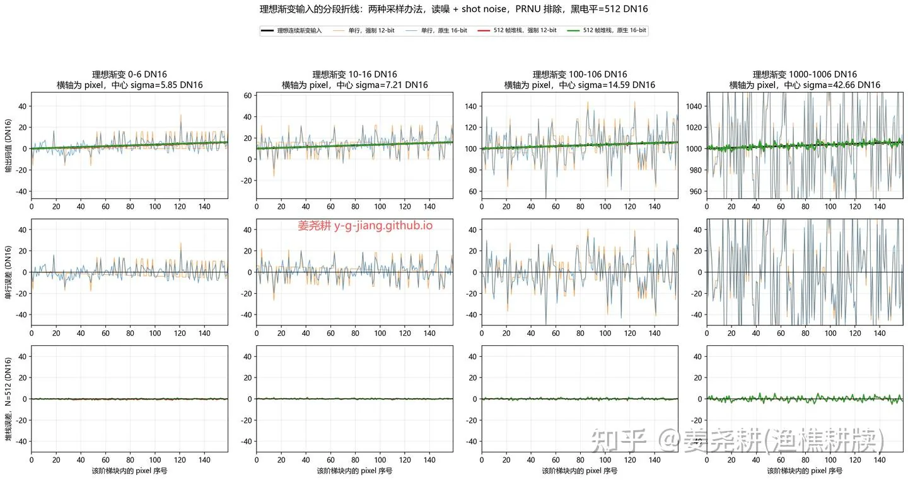
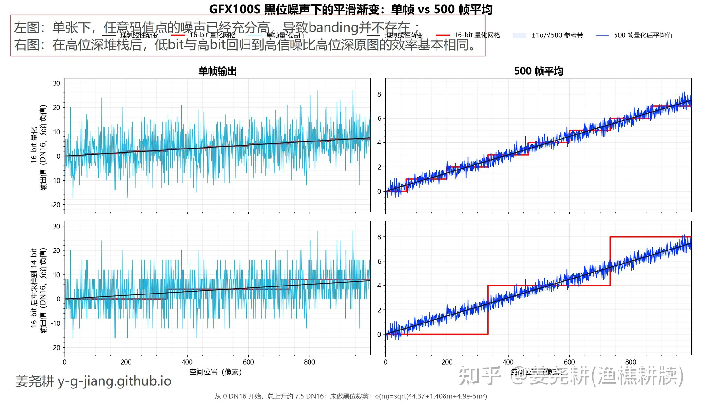
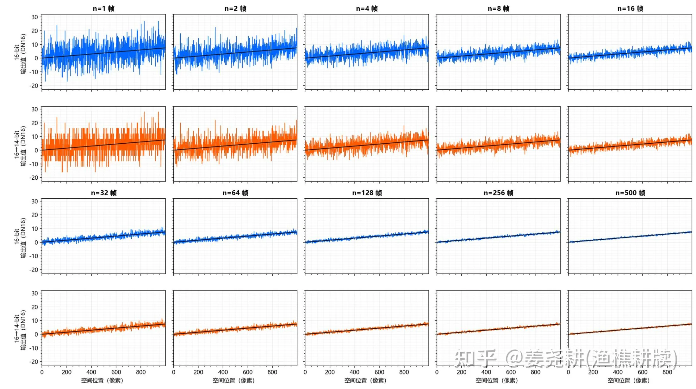

色彩位深这个东西，我在之前有很多讨论了。先放结论，后面我来详细展开。

我快期末考试了，没时间引入太多复杂模型来评估（而且引入残差并傅里叶展开会牵扯更多的感知评价，偏离【一切情况下、科研情况下均无意义】的讨论），但是证据强度还算够用。

你会发现，网络时代如此几十年，还从没有过一个人发过视频对比出【16bit相机单张经过某种调色流程，比采样到14bit后进行同样的流程更好】。

**1，对于你能买到的一切市售相机，16bit毫无价值——无论在调色上，还是在信噪比上，还是在一切后期的输出流程、科研需求中，都毫无价值。**

**2，对于一切夸张调色以及严苛的天文摄影、严苛的胶片反相/后处理，严苛的文物恢复工作，14bit及以上的相机输出位深毫无价值。**

**3，在iso400以上，一切市售相机从14bit截为12bit，pdr损失都低于0.1档。**

ps：缩图流程以及堆栈流程，出于oversampling gain，你应当把位深进行相应提高，或者在浮点上做运算。但这和相机本身的bit数毫无关系——相机8bit也不耽误你在16bit上堆栈。

有点数学直觉但不多的人可能会持有两个看法：1，起码要分配到1e/dn吧？2，16bit下总归会有多的两位信息吧？

那么我针对这两种的评价是：1，在噪声的影响下，某个电子数根本不会跑到一个确定的dn值，他的随机幅度是极大的，做不做到1e/dn并无实质含义；2，16bit下最后两位信息你可以认为是14bit左移两位，后面两位加纯随机数。

## 本文结构如下：

**1，信噪比分析（低协方差情况）。**

**1.1，对gfx100，16bit采样到14bit的动态在一切tgtsnr下差异小于0.04档；**

**1.2，对14->12bit的列举：iso400以上，14bit转12bit的pdr损失都低于0.1档。**

**2，调色下banding分析（高协方差情况）。**

**2.1，单张下，任意码值点的噪声已经充分高，导致14bit下一切相机根本不存在任何banding，这与调色程度无关，就是不存在banding；**

**2.2，对市售相机，在高位深堆栈后，低bit与高bit回归到高信噪比高位深原图的效率相同。**

## **我们先说信噪比分析，再来讲调色。**

> **总领**  
>   
> **1.1，对gfx100，16bit采样到14bit不会导致pdr可观变化；**  
> **1.2，对14->12bit的列举：iso400以上，14bit转12bit的pdr损失都低于0.1档。**

首先是16bit转14bit的情况，这是一个简单问题，快速讲完。gfx100s的表现如下，我们只看ptc**fit**dr，也就是我三参数建模后：

12.49ev->12.46ev，根本没有变化。

经

[@Tianxi](//www.zhihu.com/people/d05de6224118819ddd29f0447da00c07)

提示给出取tgtsnr趋近于零：

$\Delta DR_{\max} = \log_2\frac{4.8766}{4.7378} = \mathbf{0.04164\ stops}$ 也就是，你把14bit下的少提亮0.04档，他的信噪比就会与16bit相同并在大部分区间更高。因此从信噪比的角度来说，严格没有区别。

然后我们说一般相机把14bit采样为12bit后信噪比的变化：

关于对一切相机在14->12bit的情况，我在

[14bit RAW ΔPDR Critical ISO Curves](https://y-g-jiang.github.io/PLT.html)

这个网页中已经给得非常完备了。根据我在

[y-g-jiang/paper_IIARPTC](https://github.com/y-g-jiang/paper_IIARPTC)

这篇论文中所指出的，0.5DN以上的读出噪声下，量化误差建模为均匀量化噪声。即低位深量化步长在 14-bit ADU 单位中为：

$$
\Delta_b = 2^{14-b}
$$

均匀量化噪声的方差为：

$$
\sigma_{q,b}^2 = \frac{\Delta_b^2}{12}
$$

RMS 为：

$$
\sigma_{q,b} = \frac{\Delta_b}{\sqrt{12}}
$$

读出噪声变为：

$$
N_b(I) = k_{14}(I) \sqrt{ R_{14}(I)^2 + \frac{2^{2(14-b)}}{12} }
$$

这里只谈零协方差量化行为。因此方差相加。

**也就是12bit下你比14bit多曝光0.2档，对于iso800以上、除了a7s3之外的一切索尼机器（大概率是一切相机，因为索尼已经是噪声表现很好的一批了），12bit下信噪比上都完全领先14bit模式。**

然后我们计算snrbased dr（tgtsnr~16,000/PH）：

$$
\mathrm{SNR} = \frac{S}{\sqrt{S + N^2}}
$$

令：

$$
\frac{S}{\sqrt{S+N^2}} = T
$$

$$
S_T(N) = \frac{T^2 + \sqrt{T^4 + 4T^2N^2}}{2}
$$

14-bit 达到目标 SNR 所需信号：

$$
S_{14}(I)=S_T(N_{14}(I))
$$

低位深达到目标 SNR 所需信号：

$$
S_b(I)=S_T(N_b(I))
$$

PDR 损失定义为：

$$
\Delta \mathrm{PDR}_b(I) = \log_2 \left( \frac{S_b(I)}{S_{14}(I)} \right)
$$

单位是 stop。

  

**因此可见，iso400以上，一切市售相机在14bit转12bit时的pdr损失都低于0.1档。**

但相机adc的设计，在原生12bit下adc噪声会稍微增加。不过出于这点噪声是在后端adc处增加的，在高模拟层增益下不会干扰上述结论。

## 然后我们再来看下为什么我说14bit提供了充分优秀的调色基础。

> **总领：**  
>   
> **第一点，单张下，任意码值点的噪声已经充分高，导致banding并不存在 ；**  
> **第二点，在高位深堆栈后，低bit与高bit回归到高信噪比高位深原图的效率基本相同。**

首先我们说明白，当讨论断层的时候，哪一段最容易断层？我们不可能关心全部码值区间的。

我们引入一个量，噪声均方差比上量化阶梯，这样一个无量纲值，就是σ/Δ。

在纯线性缩放下，这个比值保持严格不变；另在对码值连续可微的调色变换中，旧量化台阶和量化前噪声由同一局部导数传播，因此该比值对既有量化结构保持一阶不变。通道拉伸、片基归一、HDR 、密度转换/反转，都是连续可微的，而且这个东西在不可微的工况下噪声也会使其没有差异。

我们引入PTC来进行分析，比如松下s52在无镜头情况下的噪声随输入信号的变化图，你会发现因为读出噪声的单位是adu，纵轴也恰好就是σ/Δ：

很明显可以看出，随着信号的上升，量化步长没有改变，但是噪声增加了，这个噪声比量化步长的比值也是在低码值部分最小。

当σ/Δ相同，且亮度、空间频率、观察条件、tone curve 局部导数、CSF 都相同时，Δ越大，断层越容易被看出。极低码值处σ/Δ最小（如上述PTC），他提亮到相同目标感知范围后也不变，因此我们可以说，暗部最低码值处的表现决定了相机系统的断层性能的最保守瓶颈。

下面我们引入gfx100作为模型。

我们可以用dpr标版艰难建模出噪声曲线，其中至少前两项是极低协方差的：

$\sigma_{\mathrm{DN}}(m)=\sqrt{44.37+1.408m+4.9\times10^{-5}m^2}$

那么我就gfx100而言，给一个比较直观的例子，在相同的码值跨度上，显然高码值区域的总噪声是更加夸张的，因此高码值的banding更容易被噪声盖过。

那么现在问题转化为：对于这个低bit下最保守的低码值处的理想渐变，是否会被看出任何情况的banding，在任何程度的调色下？

在这之前请重新看一下最低码值。与其引入评价模型，作为视觉量我希望我们还是用直观的图像来观察。我们不如来直接做一组对比：**我这里的对比使用的是最低码值的gfx100s，是σ/Δ最小处。**

这里我取了一行作为采样。因为如果你多行一齐来看的话，人眼的最小可辨识圆本身就是相当于自由位深超采了，这和跨帧平均的效果是一样的。

**在单行的情况下，噪声本身的dithering就已经让你怎么拉都看不出阶梯了。**

**所以就来到了下一个问题**，如果牵扯到人眼的自动超采，那么14比16会产生更显著的阶梯吗？或者说在多帧平均的情形下会出现任何14比16的劣势吗？

毫无差别。

最后是，无限堆栈后，是否足够平滑，还是有什么残存的周期性结构？

根据Zaman, 2004对正态随机变量小数部分的傅里叶展开，若 $Z\sim\mathcal N(\mu,\sigma^2)$，则其小数部分在 $[0,1)$ 上的密度可写为

$$
f_\sigma(x-\mu)=1+2\sum_{k=1}^{\infty}e^{-2\pi^2k^2\sigma^2}\cos\!\bigl(2\pi k(x-\mu)\bigr).
$$

将带噪信号写为 $X=s+N$, $N\sim\mathcal N(0,\sigma^2)$，并以量化步长 $\Delta$ 归一化后，量化相位的小数部分密度仍由同一结构控制，其中 $r=\sigma/\Delta$ 决定其偏离均匀分布的幅度。因此，在无限张堆栈极限下，舍入量化的期望偏置满足

$$
b_\Delta(s)=\mathbb E[Q_\Delta(X)]-s =\frac{\Delta}{\pi}\sum_{k=1}^{\infty}\frac{(-1)^k}{k}\exp\!\left[-2\pi^2k^2\left(\frac{\sigma}{\Delta}\right)^2\right]\sin\!\left(2\pi k\frac{s}{\Delta}\right),
$$

误差项由首谐波主导，近似上界是

$$
|b_\Delta(s)|\lesssim \frac{\Delta}{\pi}\exp\!\left[-2\pi^2\left(\frac{\sigma}{\Delta}\right)^2\right].
$$

在 GFX100S 黑位条件下取6.66DN16，14bit网格下r约等于1.665，首谐波幅度约为2.15\*10^-24 DN16；若是16bit网格，该幅度进一步降至约10^-381 DN16。因此，在最保守的gfx100s的模型下，无限堆栈后的回归误差虽然不严格为零，但其确定性残余已被指数压低到远低于任何实际数值或感知尺度的水平。

  

**参考文献**

Zaman, A. (2004). _The Density of the Fractional Part of a Normal Distribution_. PDF
